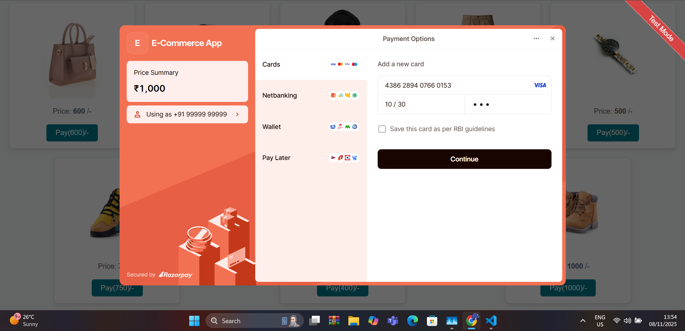
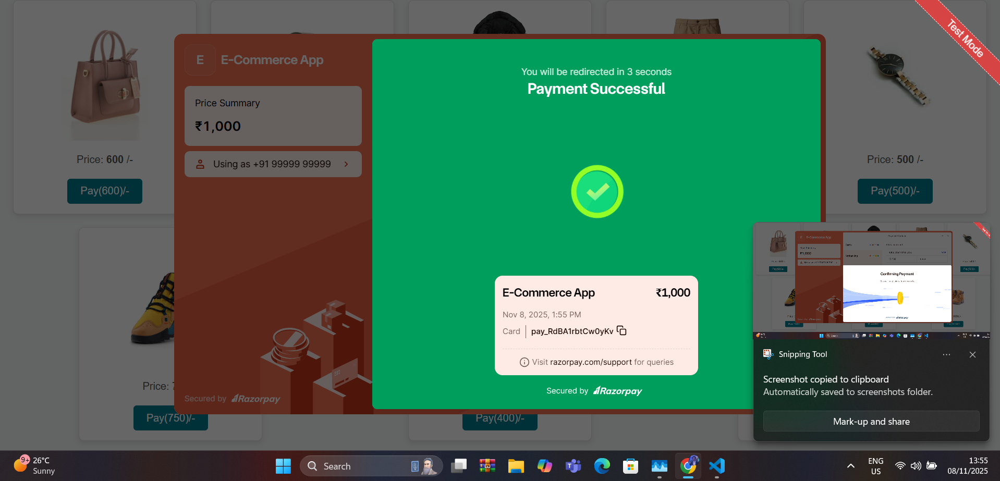
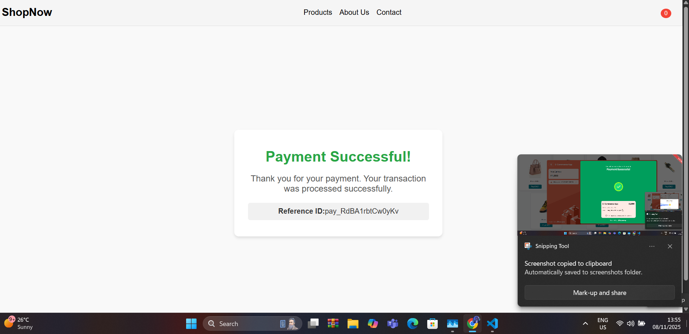

🛍️ Modern E-commerce Platform with Razorpay
============================================

This repository contains a full-stack e-commerce application designed to provide a seamless shopping experience. It features a separate backend (Node.js/Express) and frontend (React.js, assumed for this structure) and includes secure payment processing via **Razorpay** in test mode.

✨ Key Features
--------------

-   **Product Browsing:** Easily browse and view detailed information for all products.

-   **Secure Checkout:** Integrated with Razorpay for handling payments securely.

-   **Test Mode Payments:** Allows developers to test the complete payment flow without actual transactions.

-   **Separate Backend/Frontend:** Clear separation of concerns for easier development and scaling.

📸 Screenshots
--------------

Add your application screenshots here to showcase the main features (e.g., Homepage, Product Detail, Checkout Flow).


Homepage


Product Detail


Checkout Success




[Insert Homepage Image/GIF Here]

 

[Insert Product Image Here]


[Insert Confirmation Screen Here]

 |

🚀 Getting Started
------------------

Follow these steps to set up and run the project locally.

### Prerequisites

You need the following installed on your machine:

-   Node.js (v14+)

-   npm (comes with Node.js)

-   Git

### Installation and Setup

1.  **Clone the Repository:**

    ```
    git clone [YOUR_REPO_URL]
    cd [YOUR_REPO_NAME]

    ```

2.  **Install Backend Dependencies:**

    ```
    npm install

    ```

3.  **Install Frontend Dependencies:**

    ```
    cd frontend
    npm install
    cd ..

    ```

4.  **Configuration (Razorpay & Environment Variables):** Ensure you have created a **`.env`** file in your root directory (or backend directory, depending on structure) with your Razorpay Test API Keys:

    ```
    # Example .env file content
    RAZORPAY_KEY_ID="rzp_test_xxxxxxxxxxxxxx"
    RAZORPAY_KEY_SECRET="xxxxxxxxxxxxxxxxxxxxxx"
    PORT=5000

    ```

⚙️ Running the Application
--------------------------

You need to start the backend and frontend services separately.

### 1\. Start the Backend Server

The backend runs on a Node.js/Express server and handles API requests, database interactions, and secure Razorpay order creation.

```
npm run start

```

(This typically runs on `http://localhost:5000`)

### 2\. Start the Frontend Application

Navigate into the `frontend` directory and start the development server.

```
cd frontend
npm run dev

```

(This typically runs on `http://localhost:3000` or a similar port)

💳 Testing Payments with Razorpay
---------------------------------

Once the application is running, you can click on any product and proceed to the payment gateway. The application is configured to use Razorpay's **Test Mode**.

To complete a successful payment, use the following card details provided by Razorpay for testing:


Field

 <iframe width="560" height="315" src="./razorpay.mp4" frameborder="0" allowfullscreen></iframe>

Value

 
|

**Card Number**

 |

`4386 2894 0766 0153`

 |
|

**Expiry Date**

 |

Any future date (e.g., 12/28)

 |
|

**CVV**

 |

Any 3-digit number (e.g., 123)

 |
|

**PIN**

 |

`1234`




After entering these details and completing the transaction, the payment should be marked as **Successful** in the Razorpay dashboard, and your application should proceed with order confirmation.

🤝 Contributing
---------------

Contributions are welcome! Please fork the repository and submit a pull request for any features or bug fixes.
